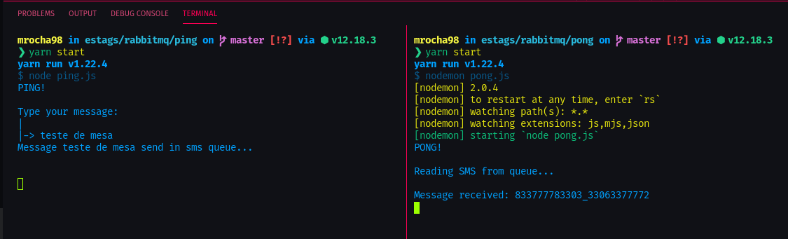

# RabbitMQ

## Finalidade

RabbitMQ é um Message Broker feito em Erlang.

Message brokers podem validar, armazenar, rotear e distribuir mensagens para os destinos apropriados. Eles servem como intermediários (middlewares) entre aplicações, permitindo que os remetentes (senders) emitam mensagens sem a necessidade de saber onde os destinatários (receivers) estão, quantos são e se estão ativos ou não.

A grande vantagem de utilizá-lo é que ocorre uma dissociação de processos e serviços dentro dos sistemas, permitindo o desenvolvimento dentro de arquitetura de microserviços.

## Publisher vs Subscriber

Também encontrado como "pub/sub", esse padrão de distribuição de mensagens consiste em uma espécie de "relacionamento one-to-many", onde o pub pública uma mensagem e múltiplos subscribers consomem o que for do interesse deles.

Um exemplo de uso: Uma companhia aérea distribui informações sobre os dados dos voos (tempo de atraso, localização, etc.). Múltiplos grupos podem utilizar dessas informações. As aeromoças e os pilotos preparando o próximo voo, funcionários responsáveis pela pista pouso, passageiros esperando a decolagem, etc.

## Projeto

1. Configurar comunicação entre dois projetos distintos e fazer um ping pong entre eles.
2. Publicar mensagem em 1 projeto e fazer os logs no console;
3. Ouvir no outro projeto e fazer os logs no console;

## Links de referência

- <https://www.ibm.com/cloud/learn/message-brokers>
- <https://www.rabbitmq.com/tutorials/tutorial-one-javascript.html>
